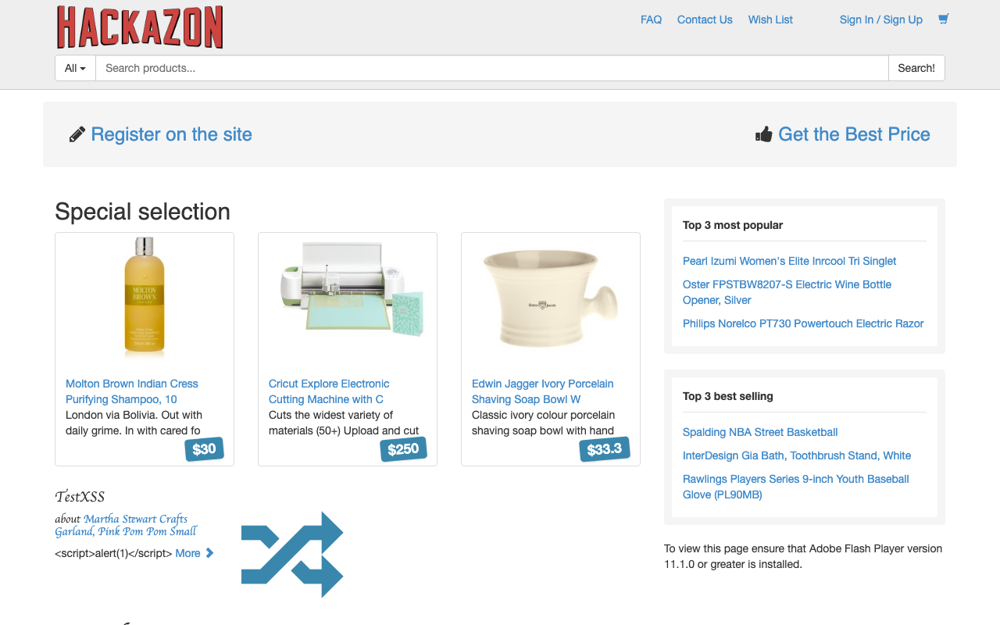
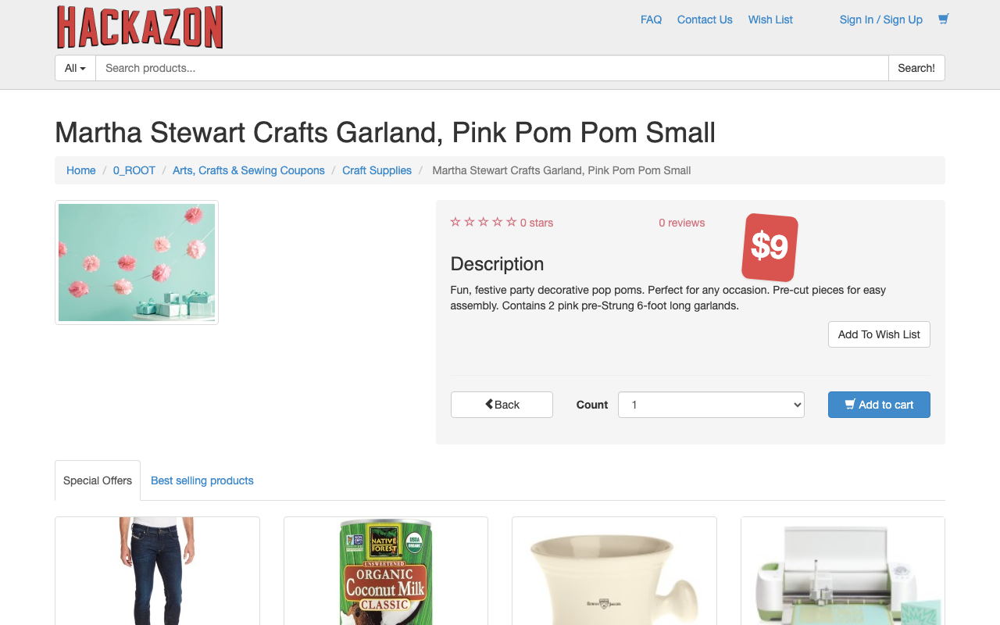
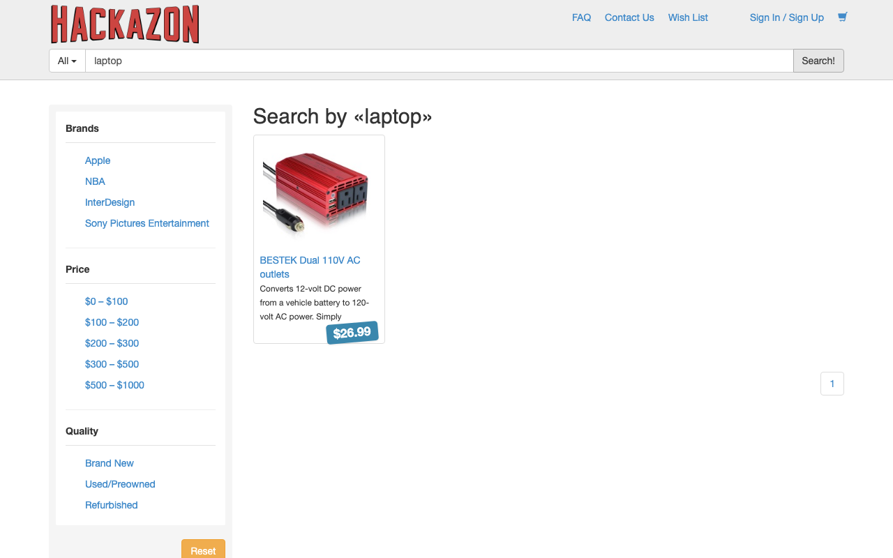
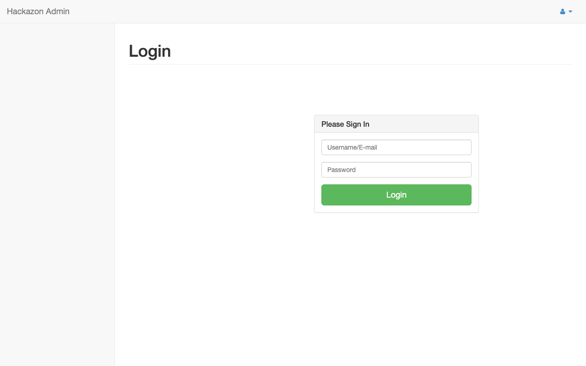
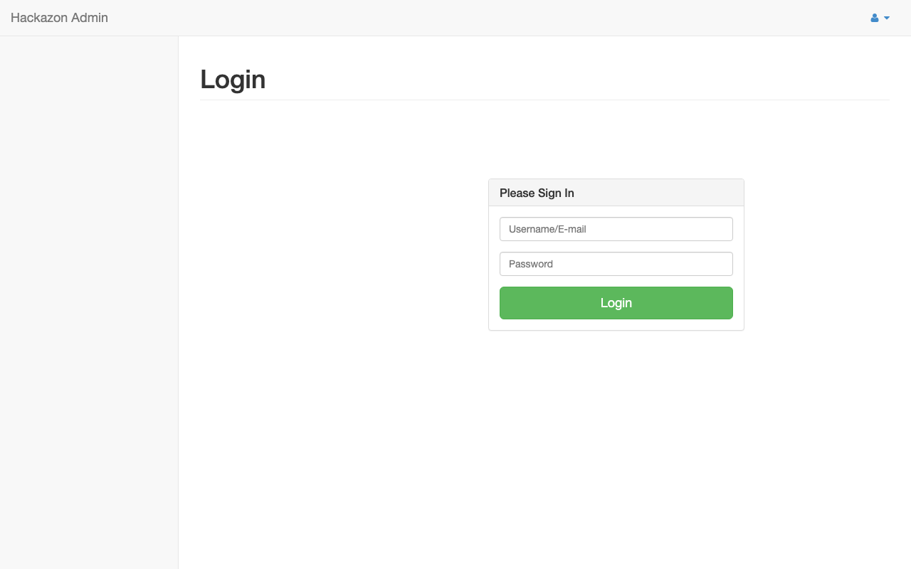
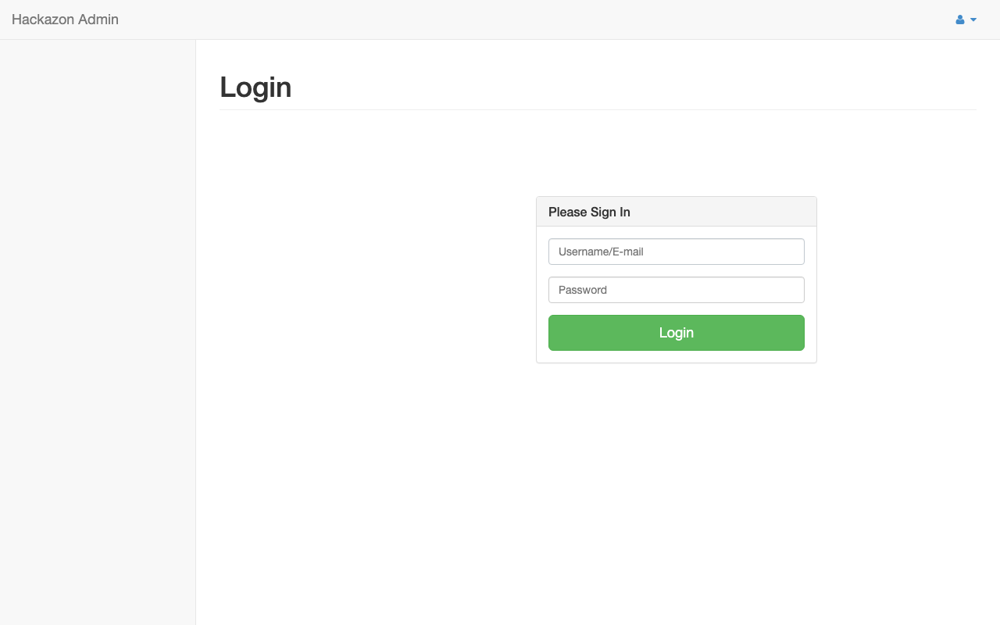

# Hackazon — Laravel Migration

> **Based on [Hackazon by Rapid7](https://github.com/rapid7/hackazon)** — all credit for the original application, vulnerability design, and training content goes to the Rapid7 team.

Hackazon is an **intentionally vulnerable** e-commerce web application originally built by Rapid7 for offensive security training. This repository is a complete migration of the original PHP 5.4 / PHPixie codebase to **PHP 8.4 / Laravel 13**, carried out with the assistance of AI (Claude by Anthropic).

> **WARNING:** This application contains deliberate security vulnerabilities including SQL Injection, XSS, CSRF, IDOR, Remote File Inclusion, XXE, and OS Command Injection. **Do not deploy on a public server or production environment.**

---

## Screenshots

| Storefront | Product Page |
|:---:|:---:|
|  |  |

| Search Results | Admin — Products |
|:---:|:---:|
|  |  |

| Vulnerability Matrix | Vulnerability Editor |
|:---:|:---:|
|  |  |

---

## Stack

| Layer | Technology |
|---|---|
| Language | PHP 8.4+ |
| Framework | Laravel 13 |
| Database | MySQL 8 (same schema as original) |
| Frontend | jQuery + Knockout.js + Bootstrap (unchanged) |
| Special modules | GWT (Google Web Toolkit), AMF/Flash, REST API |

---

## Running with Docker (recommended)

Docker is the recommended way to run Hackazon for security labs. It handles all dependencies automatically and makes resetting the database trivial between student sessions.

### Requirements

- [Docker Desktop](https://www.docker.com/products/docker-desktop/) (or Docker Engine + Compose v2)

### Start the lab

```bash
git clone https://github.com/agugliotta/hackazon.git
cd hackazon

# Build and start (first run ~2 minutes)
docker compose up -d --build
```

The app will be available at **http://localhost:8080**

### Reset the database

Students can trigger XSS payloads, create accounts, place orders, etc. Restore a clean state between sessions:

```bash
# Wipe only the database, keep app running (~15 seconds)
./docker/reset-db.sh

# Full teardown and rebuild
./docker/reset-db.sh --full
```

### Useful commands

```bash
docker compose logs -f app     # tail application logs
docker exec -it hackazon_app bash          # shell inside app container
docker exec -it hackazon_db mysql -uhackazon -phackazon hackazon  # MySQL shell
docker compose down            # stop (data preserved)
```

---

## Manual setup (without Docker)

### Requirements

- PHP 8.4+
- MySQL 8
- Composer

### Installation

```bash
composer install

cp .env.example .env
# Edit .env — set DB_HOST, DB_DATABASE, DB_USERNAME, DB_PASSWORD

php artisan key:generate

mysql -u hackazon -p hackazon < database/hackazon_schema.sql
mysql -u hackazon -p hackazon < database/migration_coupons.sql
mysql -u hackazon -p hackazon < database/migration_credit_card.sql
mysql -u hackazon -p hackazon < database/hackazon_demo_data.sql

php artisan serve
```

---

## Demo Credentials

| Role | Username | Password |
|---|---|---|
| Admin | `admin` | `123456` |
| User | `test_user` | `123456` |

---

## Intentional Vulnerabilities

All vulnerabilities are preserved from the original application and can be toggled per-context from the admin panel at `/admin/vulnerability`.

| Vulnerability | Entry Point |
|---|---|
| SQL Injection (UNION) | Search bar — `' UNION SELECT ...` |
| SQL Injection (blind) | Wishlist search |
| XSS (Reflected) | Login — username echoed back unescaped |
| XSS (Stored) | Product reviews, profile fields |
| CSRF | Checkout, cart, best price form |
| IDOR | Orders `/account/orders/{id}`, wishlists |
| Remote File Inclusion | Account → Help articles `?page=` |
| OS Command Injection | Account → Documents `?page=` |
| XXE | REST API — `POST /api/user` with `Content-Type: application/xml` |
| Arbitrary File Upload | Profile photo upload |

### Enabling / Disabling Vulnerabilities

1. Log in as admin → go to **http://localhost:8080/admin/vulnerability**
2. Select a **context** from the dropdown (e.g. `account`, `search`, `user`)
3. Check **Edit Mode**
4. Toggle vulnerability checkboxes and click **Save changes**

Changes apply immediately — no restart required.

---

## Admin Interface

**URL:** http://localhost:8080/admin

| Section | URL |
|---|---|
| Dashboard / Vuln Matrix | `/admin` |
| Vulnerability Editor | `/admin/vulnerability` |
| Products | `/admin/product` |
| Users | `/admin/user` |
| Orders | `/admin/order` |
| Categories | `/admin/category` |
| FAQs | `/admin/faq` |
| Coupons | `/admin/coupon` |

---

## Architecture

```
app/
  Http/Controllers/     Laravel controllers (one per PHPixie controller)
  Models/               Eloquent models (same table names as original)
  VulnModule/           Vulnerability injection system (preserved as-is)
  AmfphpModule/         AMF/Flash gateway
  Services/             CartService, AuthService
  Auth/                 MD5 auth provider (legacy password hashing)

resources/views/        Blade templates
routes/web.php          Frontend + admin routes
routes/api.php          REST API routes
database/               SQL schema + demo seed data
assets/config/vuln/     Per-context vulnerability config files (PHP arrays)
assets/config/vuln.sample/  Default/reference configs (used by Restore button)
content_pages/          Static help article content (PHP includes)
docker/                 Entrypoint script, MySQL init
public/                 Static assets, GWT compiled JS
vendor/
  hackazon/amfphp/      AMF library (vendored — not on Packagist)
  gwtphp/gwtphp/        GWT PHP library (vendored — not on Packagist)
```

---

## Notes

- **Password hashing:** MD5 — preserved for compatibility with original demo data
- **Sessions:** File-based (`SESSION_DRIVER=file`)
- **CSRF:** Disabled globally — intentional (CSRF is a training vulnerability)
- **`allow_url_include`:** Enabled in Docker for RFI vulnerability
- **GWT helpdesk:** `/helpdesk` served through Laravel via `.htaccess` rewrite rule (the `public/helpdesk/` directory would otherwise shadow the route)
- **AMF endpoint:** `/amf` requires a Flash client; back office at `/amf_back_office/`

---

## Coverage

61 routes tested (GET + admin CRUD + API), all returning 200. Verified vulnerabilities:

- SQLi UNION — search extracts DB user via `' UNION SELECT user(),...`
- XSS Reflected — `<script>alert(1)</script>` in login username echoed back
- XXE — `<!ENTITY xxe SYSTEM "file:///etc/passwd">` returns `/etc/passwd` in response
- OS Command Injection — `?page=terms.html;id` executes `id` and returns output
- Remote File Inclusion — `?page=rest` loads arbitrary PHP include

---

## Credits & Original Project

**Original application:** [Hackazon by Rapid7](https://github.com/rapid7/hackazon)
— PHP 5.4 / PHPixie, all vulnerability design and training content by the Rapid7 team.

**This migration** was performed with the assistance of [Claude Code](https://claude.ai/code) (Anthropic).
The migration preserves all intentional vulnerabilities exactly as designed in the original.
